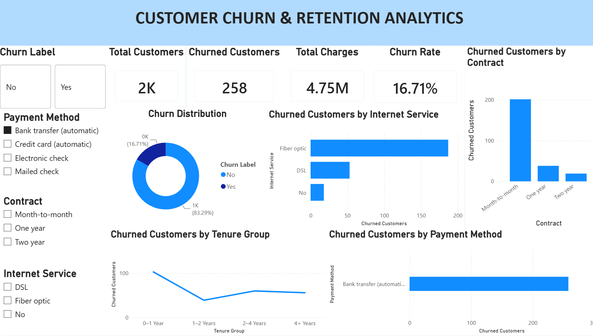

# Customer Churn & Retention Analytics Dashboard

## About the Project

This is a Power BI project based on a telecom customer dataset.  
The main goal of this project is to understand customer churn and look at the factors related to customers leaving the service.

The dashboard shows customer and churn-related information using different charts, KPIs, and filters.

## Dashboard

The dashboard includes:

- Total Customers
- Churned Customers
- Total Charges
- Churn Rate
- Churn Distribution
- Churn by Contract
- Churn by Internet Service
- Churn by Tenure Group
- Churn by Payment Method
- Churn Reasons and other churn-related analysis

## Tools Used

- Power BI
- Power Query
- DAX
- Excel

## What I Worked On

- Cleaned and prepared the data using Power Query
- Created DAX measures for important metrics
- Created interactive charts and KPI cards
- Added slicers for filtering the dashboard
- Analyzed churn based on customer and service-related factors

## Dashboard Preview

## Project File

The Power BI report file is included in this repository:

`Customer_Churn_Retention_Analytics.pbix`
